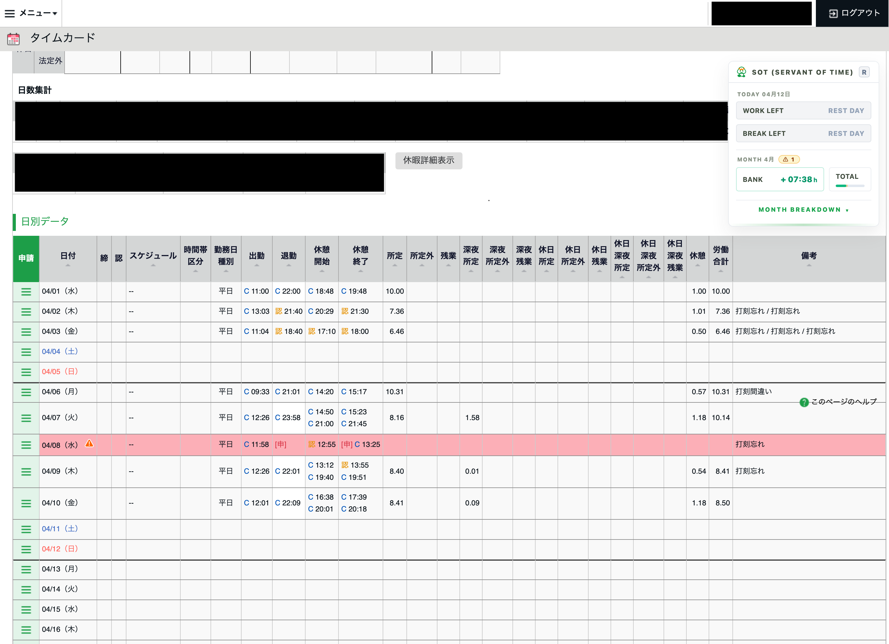
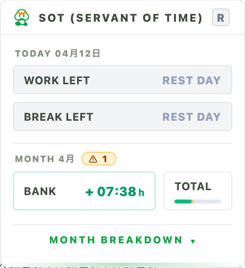

<p align="center">
  
</p>

<h1 align="center">SOT</h1>
<p align="center"><strong>SERVANT OF TIME</strong></p>
<p align="center">An unofficial Firefox-first WebExtension that adds a focused overlay to the KING OF TIME admin monthly working page.</p>

<p align="center">Made by <a href="https://github.com/kevinher7">@kevinher7</a> · Logo made by pimchot</p>

<figure align="center">
  <table align="center">
    <tr>
      <td align="center" valign="top">
        
      </td>
      <td align="center" valign="top">
        
      </td>
    </tr>
  </table>
  <figcaption><em>Left: SOT on the monthly working page. Right: the summary overlay panel.</em></figcaption>
</figure>

> Unofficial project. SOT is not affiliated with, endorsed by, or sponsored by Human Technologies or KING OF TIME.

- **Repository:** <https://github.com/kevinher7/sot>
- **Issues / support:** <https://github.com/kevinher7/sot/issues>

## What it does

SOT reads the currently open monthly timecard page and renders an in-page summary overlay to make the page easier to understand at a glance.

Current v1 behavior:

- shows an overlay summary on the monthly working page
- calculates today and month-level metrics from the page data
- accounts for request-related time corrections when available
- stores extension settings locally in the browser
- stays intentionally narrow in scope instead of running across the full KING OF TIME product

## Supported page scope

The extension only runs on:

- `https://s2.ta.kingoftime.jp/admin/*`

## Permissions and privacy

SOT keeps its access intentionally narrow.

- **Host access:** `https://s2.ta.kingoftime.jp/admin/*`
- **Extension permission:** `storage`
- **Firefox AMO data disclosure:** `websiteContent`, `personallyIdentifyingInfo`
- **Data handling:** settings and parsed request-cache data are stored locally in `browser.storage.local`
- **Network scope:** only the signed-in KING OF TIME pages needed for the monthly page and related request-list lookup
- **Third-party services:** none

For full details, see [PRIVACY.md](./PRIVACY.md).

## Installation

### For end users

SOT is not published to the Firefox Add-ons store yet.

Right now, the extension can be used by loading a locally built version into Firefox or Zen Browser.

### Firefox / Zen Browser (temporary local install)

1. Install dependencies:
   ```bash
   npm install
   ```
2. Build the extension:
   ```bash
   npm run build
   ```
3. Open `about:debugging#/runtime/this-firefox`.
4. Click **Load Temporary Add-on...**.
5. Select `dist/manifest.json`.

### Support

- Report bugs or request features: <https://github.com/kevinher7/sot/issues>
- Source code: <https://github.com/kevinher7/sot>

## Development

### Requirements

- Node.js 24.14.0
- npm 11.9.0
- Firefox or Zen Browser

From the repository root:

```bash
npm ci
npm run build
```

The built extension files are written to `dist/`.

### Start a watch build

```bash
npm run dev
```

### Type-check

```bash
npm run typecheck
```

### Lint

```bash
npm run lint
```

### Production build

```bash
npm run build
```

## Project status

SOT is currently a focused content-script extension with a deliberately small v1 scope.

### Features in progress

- Working on chromium support
- Month breakdown panel
- CSS augmented page (highlight current day, etc)
- Remove recorder invalid buttons based on current status

### Maybe

Potentially but not sure

- Easier 申請 panel from a popup

## Support

For bug reports, feature requests, or questions, please open an issue:

- <https://github.com/kevinher7/sot/issues>

## License

Released under the [MIT License](./LICENSE).
